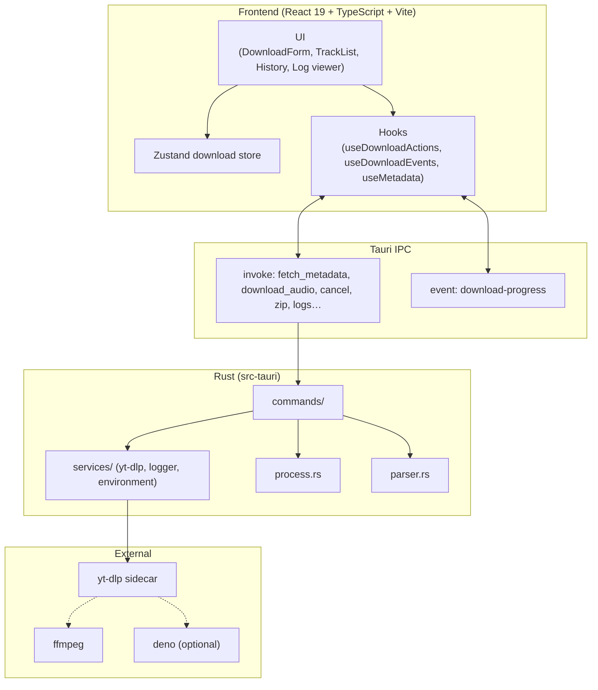

<div align="center">

# YouTube Playlist & Audio Downloader

**Lightweight, high-performance YouTube audio downloader built with Tauri v2, Rust, React 19, and Tailwind CSS**

[English](README.md) | [한국어](README_KO.md)

[](https://v2.tauri.app/)
[](https://www.rust-lang.org/)
[](https://react.dev/)
[](https://www.typescriptlang.org/)
[](https://tailwindcss.com/)
[](https://www.gnu.org/licenses/gpl-3.0)

<p align="center">
  A cross-platform desktop app that batch-extracts YouTube videos or full playlists into high-quality AAC (<code>.m4a</code>), with album artwork and metadata embedded automatically.
</p>

</div>

---

## Table of Contents

1. [Download & OS Support](#download--os-support)
2. [Key Features](#key-features)
3. [Documentation](#documentation)
4. [Architecture](#architecture)
5. [Prerequisites](#prerequisites)
6. [Installation & Build](#installation--build)
7. [Usage](#usage)
8. [Limitations](#limitations)
9. [Roadmap](#roadmap)
10. [Author & License](#author--license)

---

## Download & OS Support

Pre-built binaries are available on **[GitHub Releases](https://github.com/s4ngwoo/youtube-playlist-downloader/releases/latest)**.

| Platform | Status | Installer / Binary | Notes |
| :--- | :---: | :--- | :--- |
| **macOS (Apple Silicon)** | **Official** | `*.dmg` (`aarch64`) | M1 / M2 / M3 / M4 |
| **macOS (Intel x86_64)** | **Official** | `*.dmg` (`x64` / `x86_64`) | Intel Mac |
| **Windows (x64)** | **Official** | `*-setup.exe`, `*.msi` | Windows 10/11 (64-bit) |
| **Linux** | In progress | — | Build from source |

### First launch on macOS

This open-source build is not notarized with a paid Apple Developer certificate. Gatekeeper may block the first launch.

1. Open the `.dmg` and drag the app into **Applications**.
2. In **Applications**, **right-click (or Control-click) → Open**.
3. Confirm **Open** in the security dialog.  
   Or use **System Settings → Privacy & Security → Open Anyway**.

### First launch on Windows

If SmartScreen appears: **More info → Run anyway**.

---

## Key Features

- **Playlist & single-video support** — Paste a video or playlist URL; the app detects tracks and downloads them in batch.
- **Selective download** — Fetch playlist metadata first, then choose which tracks to download.
- **High-quality AAC `.m4a`** — Prefer maximum-quality audio extraction with embedded cover art and tags.
- **Metadata editing** — Adjust title/artist (and related tags) before or alongside export flows.
- **Download history** — Revisit previous playlist URLs and reload them from a local history store.
- **Mobile-friendly ZIP (NFC)** — Export a ZIP with NFC-normalized filenames so Korean names stay intact on Android/Windows.
- **Process tree cleanup** — Cancel, close, or quit cleanly; `yt-dlp` / `ffmpeg` child processes are terminated.
- **Deno-aware yt-dlp** — Uses a local Deno runtime when available for YouTube JS challenge solving.
- **App log viewer** — Persistent local logs with a dedicated viewer window for troubleshooting.
- **macOS polish** — Traffic-light safe area and a draggable title region.

---

## Documentation

This project remains **open source (GPL-3.0)**. Full docs index: [docs/README.md](docs/README.md) · Korean: [docs/ko/README.md](docs/ko/README.md)

| Document | English | Korean |
| :--- | :--- | :--- |
| Privacy Policy | [docs/PRIVACY.md](docs/PRIVACY.md) | [docs/ko/PRIVACY.md](docs/ko/PRIVACY.md) |
| Terms of Use | [docs/TERMS.md](docs/TERMS.md) | [docs/ko/TERMS.md](docs/ko/TERMS.md) |
| Security | [docs/SECURITY.md](docs/SECURITY.md) | [docs/ko/SECURITY.md](docs/ko/SECURITY.md) |
| Contributing | [docs/CONTRIBUTING.md](docs/CONTRIBUTING.md) | [docs/ko/CONTRIBUTING.md](docs/ko/CONTRIBUTING.md) |
| Code of Conduct | [docs/CODE_OF_CONDUCT.md](docs/CODE_OF_CONDUCT.md) | [docs/ko/CODE_OF_CONDUCT.md](docs/ko/CODE_OF_CONDUCT.md) |
| FAQ | [docs/FAQ.md](docs/FAQ.md) | [docs/ko/FAQ.md](docs/ko/FAQ.md) |
| Support | [docs/SUPPORT.md](docs/SUPPORT.md) | [docs/ko/SUPPORT.md](docs/ko/SUPPORT.md) |
| Changelog | [docs/CHANGELOG.md](docs/CHANGELOG.md) | [docs/ko/CHANGELOG.md](docs/ko/CHANGELOG.md) |

Korean overview: **[README_KO.md](README_KO.md)**

---

## Architecture

Built with **Tauri v2** (small footprint vs Electron). Frontend and Rust backend communicate over IPC.



### Project layout (simplified)

```
YoutubePlaylistDownloader/
├── src/                 # React frontend (components, hooks, store, services)
├── src-tauri/           # Rust backend (commands, services, yt-dlp sidecar)
├── docs/                # Project documentation
├── .github/workflows/   # Release CI
├── LICENSE              # GPL-3.0
└── package.json
```

---

## Prerequisites

1. **Node.js** 18+ (LTS recommended)
2. **Rust** 1.77+ and Cargo — [rustup.rs](https://rustup.rs)
3. **FFmpeg** (required for audio/thumbnail processing)

```bash
# macOS
brew install ffmpeg

# Windows (Chocolatey)
choco install ffmpeg
```

4. **Deno** (recommended for YouTube JS challenges)

```bash
# macOS
brew install deno

# Windows
choco install deno
```

---

## Installation & Build

### 1. Clone and install

```bash
git clone https://github.com/s4ngwoo/youtube-playlist-downloader.git
cd youtube-playlist-downloader
npm install
```

### 2. Place the yt-dlp sidecar

Put a platform-matched binary in `src-tauri/bin/`:

```text
# macOS Apple Silicon
src-tauri/bin/yt-dlp-aarch64-apple-darwin

# macOS Intel
src-tauri/bin/yt-dlp-x86_64-apple-darwin

# Windows x64
src-tauri/bin/yt-dlp-x86_64-pc-windows-msvc.exe
```

Download from [yt-dlp releases](https://github.com/yt-dlp/yt-dlp/releases), rename to the Tauri sidecar triple, and `chmod +x` on Unix.

### 3. Develop

```bash
npm run tauri dev
```

### 4. Production build

```bash
npm run tauri build
```

- **macOS**: `.dmg` / `.app` under `src-tauri/target/release/bundle/`
- **Windows**: NSIS / MSI under `src-tauri/target/release/bundle/`

---

## Usage

1. Choose a download folder (**Change Folder**). The path is saved in app settings (`settings.json`).
2. Optionally set **concurrency** (1–8) and **audio format** (m4a / mp3).
3. Paste a YouTube video or playlist URL.
4. Fetch metadata, select tracks if prompted, then start the download.
5. Watch per-track progress and status; failed items can be retried.
6. Optionally export a mobile-friendly ZIP, run **Environment diagnose**, or open the app log viewer.
7. **Cancel** stops the job and cleans up background processes.

---

## Limitations

- YouTube player / signature changes can temporarily break or throttle downloads; keep `yt-dlp` (and Deno) updated.
- FFmpeg must be on `PATH` (or in common install locations).
- **Copyright & ToS**: Intended for personal / educational offline use. You are responsible for complying with copyright law and YouTube’s Terms of Service. See [Terms of Use](docs/TERMS.md).
- DRM-protected media cannot be downloaded.

---

## Roadmap

- [x] More output formats — **m4a / mp3** (FLAC, WAV, OPUS later)
- [x] Broader concurrent download controls — **1–8 workers**
- [ ] In-app yt-dlp auto-update
- [ ] Richer download history / folder shortcuts
- [ ] Built-in mini audio preview player
- [x] Official Intel macOS release binaries
- [ ] Official Linux release binaries

---

## Author & License

- **Author**: Lee SangWoo
- **Email**: [s4ngwoo.lee@gmail.com](mailto:s4ngwoo.lee@gmail.com)
- **GitHub**: [@s4ngwoo](https://github.com/s4ngwoo)

Licensed under the **[GNU General Public License v3.0](LICENSE)**. You may study, modify, and redistribute the software under GPL-3.0 terms; derivative works must remain open source under the same license.
