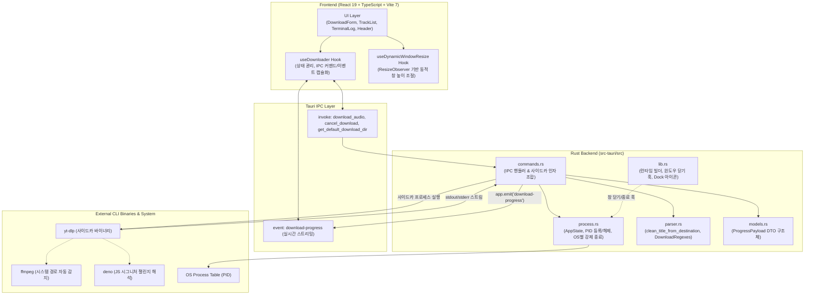

<div align="center">

# 🎵 YouTube Playlist & Audio Downloader

**Tauri v2 + Rust + React 19 + Tailwind CSS 기반의 초경량·고성능 유튜브 오디오 다운로더**

[](https://v2.tauri.app/)
[](https://www.rust-lang.org/)
[](https://react.dev/)
[](https://www.typescriptlang.org/)
[](https://tailwindcss.com/)
[](https://www.gnu.org/licenses/gpl-3.0)

<p align="center">
  유튜브 단일 영상뿐 아니라 <b>대규모 재생목록(Playlist)</b>까지 한 번의 클릭으로 최고 음질(AAC <code>.m4a</code>)로 일괄 추출하고,<br>
  고화질 앨범 커버아트와 오디오 메타데이터(ID3 태그)를 음원 파일 내부에 자동으로 완벽 임베딩해 주는 크로스플랫폼 데스크톱 애플리케이션입니다.
</p>

</div>

---

## 📑 목차 (Table of Contents)
1. [📥 앱 다운로드 및 지원 환경 (Download & OS Support)](#-앱-다운로드-및-지원-환경-download--os-support)
2. [✨ 주요 기능 (Key Features)](#-주요-기능-key-features)
3. [🏛️ 시스템 아키텍처 (Architecture)](#️-시스템-아키텍처-architecture)
4. [⚙️ 사전 요구사항 (Prerequisites)](#️-사전-요구사항-prerequisites)
5. [📦 설치 및 직접 빌드 방법 (Installation & Build)](#-설치-및-직접-빌드-방법-installation--build)
6. [💡 사용 예시 (Usage Guide)](#-사용-예시-usage-guide)
7. [⚠️ 한계점 및 유의사항 (Limitations & Considerations)](#️-한계점-및-유의사항-limitations--considerations)
8. [🔮 로드맵 및 향후 계획 (Future Roadmap)](#-로드맵-및-향후-계획-future-roadmap)
9. [👨‍💻 작성자 및 라이선스 (Author & License)](#-작성자-및-라이선스-author--license)

---

## 📥 앱 다운로드 및 지원 환경 (Download & OS Support)

최신 빌드 파일(`.dmg`)은 **[GitHub Releases](https://github.com/s4ngwoo/youtube-playlist-downloader/releases/latest)**에서 바로 다운로드하실 수 있습니다.

### 💻 플랫폼별 지원 현황
| 플랫폼 | 지원 여부 | 다운로드 파일 | 비고 |
| :--- | :---: | :--- | :--- |
| **macOS (Apple Silicon)** | **공식 지원** | `*.dmg` (`aarch64`) | M1 / M2 / M3 / M4 Mac 전용 |
| **Windows (x64)** | **공식 지원** | `*-setup.exe`, `*.msi` | Windows 10/11 (64-bit) |
| **macOS (Intel x86_64)** | ⏳ 준비 중 | - | 소스코드 직접 빌드 가능 |
| **Linux** | ⏳ 준비 중 | - | 소스코드 직접 빌드 가능 |

#### 💡 macOS에서 처음 실행 시 ("확인되지 않은 개발자" 안내 해결법)
Apple 개발자 유료 인증서(Notarization)를 거치지 않은 오픈소스 앱이므로, macOS 보안 정책(Gatekeeper)에 의해 첫 실행 시 *"개발자를 확인할 수 없기 때문에 열 수 없습니다"* 경고창이 나타날 수 있습니다.
1. 다운로드한 `.dmg` 파일을 열고, 앱 아이콘을 `Applications(응용 프로그램)` 폴더로 드래그하여 설치합니다.
2. 응용 프로그램 폴더에서 앱을 **마우스 우클릭(또는 Control + 클릭) $\rightarrow$ [열기]**를 선택합니다.
3. 나타나는 보안 팝업에서 **[열기]** 버튼을 클릭하시면 이후부터 정상적으로 실행됩니다.  
*(또는 **시스템 설정** $\rightarrow$ **개인정보 보호 및 보안** $\rightarrow$ 화면 하단의 **"확인 없이 열기"** 버튼 클릭)*

#### 💡 Windows에서 처음 실행 시 (SmartScreen 안내)
Windows SmartScreen 파란색 경고창이 나타나면 **[추가 정보]** $\rightarrow$ **[실행]** 버튼을 클릭하시면 정상적으로 설치 및 실행됩니다.

---

## ✨ 주요 기능 (Key Features)

- **⚡ 플레이리스트 및 단일 영상 완벽 대응**
  - 유튜브 단일 클립뿐 아니라 수십~수백 곡으로 구성된 유튜브 재생목록(Playlist) URL을 입력하면 자동으로 전 트랙을 감지하여 순차 일괄 다운로드합니다.
- **🎧 최고 음질(VBR 0) AAC `.m4a` 인코딩**
  - 원본 음원 손실을 최소화하는 최고 퀄리티 인코딩 옵션을 기본 적용하여 고음질 사운드를 보장합니다.
- **🖼️ 앨범 커버아트 & ID3 메타데이터 자동 내장**
  - WebP 썸네일을 표준 고화질 JPG로 자동 변환한 후 `.m4a` 컨테이너 내부에 직접 내장합니다.
  - 디스크에 불필요한 별도 썸네일 이미지 파일(`.jpg`, `.webp`)을 남기지 않고 깔끔하게 정리합니다.
- **🛡️ 강력한 프로세스 트리 클린업 (좀비 프로세스 원천 방지)**
  - 다운로드 도중 취소(Cancel)를 누르거나, 창을 닫거나, 앱을 종료할 때 백그라운드에 `yt-dlp`나 `ffmpeg`가 남아 CPU/메모리를 갉아먹지 않도록 OS별 하위 프로세스 트리(`kill -9`, Windows `taskkill /F /T`)를 즉시 전수 정리합니다.
- **🚀 YouTube EJS 챌린지 및 속도 저하 방지 (Deno 연동)**
  - 시스템에 설치된 Deno JavaScript 런타임을 자동 감지하여 `--js-runtimes deno` 인자를 주입함으로써, 유튜브의 최신 시그니처 챌린지와 다운로드 속도 제한을 완벽하게 우회합니다.
- **📊 실시간 트랙 모니터링 & 터미널 라이브 스트리밍**
  - 현재 곡 번호/전체 곡 수, 곡 제목, 다운로드 진행률(%), 변환/태깅 상태 뱃지, 실시간 다운로드 속도(`MiB/s`), 남은 예상 시간(`ETA`)을 실시간으로 확인합니다.
  - 하단 콘솔을 통해 `yt-dlp` 표준 출력 로그를 실시간 확인하고 접기/펼치기 및 자동 스크롤을 제어할 수 있습니다.
- **🖥️ macOS 네이티브 최적화 & 커스텀 드래그 영역**
  - 트래픽 라이트(신호등 버튼)와 겹치지 않는 세련된 Safe Area 상단 여백을 지원합니다.
  - 헤더 영역 전체를 마우스로 잡고 창을 이동할 수 있는 `data-tauri-drag-region`이 적용되어 있으며, 개발 모드와 빌드 모드 모두 독(Dock)에 누끼 앱 아이콘이 깔끔하게 표시됩니다.

---

## 🏛️ 시스템 아키텍처 (Architecture)

본 프로젝트는 **Electron 대비 메모리 점유율이 80% 이상 적고 빠른 시작 속도를 자랑하는 Tauri v2** 기반으로 설계되었으며, 프론트엔드와 백엔드가 철저한 **단일 책임 원칙(SRP)**에 따라 모듈화되어 있습니다.



### 소스코드 디렉토리 구조

```
YoutubePlaylistDownloader/
├── public/                 # 정적 에셋
├── src/                    # React 프론트엔드
│   ├── components/         # 모듈화된 UI 컴포넌트
│   │   ├── icons/          # SVG 아이콘 (GithubIcon 등)
│   │   ├── DownloadForm.tsx# 저장 경로 선택, URL 입력, 전체 진행 바
│   │   ├── TrackList.tsx   # 트랙별 상태 목록 및 아코디언/진행 게이지
│   │   ├── TerminalLog.tsx # 실시간 콘솔 로그 뷰어
│   │   ├── Header.tsx      # 타이틀바 및 드래그 영역, 개발자 링크
│   │   └── Footer.tsx      # 하단 푸터
│   ├── hooks/              # 비즈니스 로직 커스텀 훅
│   │   ├── useDownloader.ts          # IPC 호출 및 실시간 스트림 이벤트 관리
│   │   └── useDynamicWindowResize.ts # 콘텐츠 높이에 따른 창 크기 자동 조절
│   ├── types/              # TypeScript 인터페이스 (ProgressPayload, TrackItem 등)
│   ├── App.tsx             # 각 컴포넌트들을 조합하는 최상위 컨테이너
│   └── App.css             # Tailwind v4 스타일 및 커스텀 스크롤바
├── src-tauri/              # Rust 네이티브 백엔드
│   ├── bin/                # 플랫폼별 yt-dlp 사이드카 바이너리
│   ├── icons/              # 멀티 플랫폼 앱 아이콘 (icns, ico, png 등)
│   ├── src/
│   │   ├── commands.rs     # download_audio, cancel_download 커맨드 핸들러
│   │   ├── process.rs      # AppState 및 PID 기반 프로세스 라이프사이클 관리
│   │   ├── parser.rs       # yt-dlp stdout 파싱용 사전 컴파일 정규식 모음
│   │   ├── models.rs       # DTO 데이터 구조체 정의
│   │   ├── lib.rs          # Tauri 빌더, Cocoa Dock 아이콘, 종료 이벤트 훅
│   │   └── main.rs         # 실행 엔트리포인트
│   ├── Cargo.toml          # Rust 의존성 설정
│   └── tauri.conf.json     # Tauri v2 번들 및 윈도우 설정
└── package.json
```

---

## ⚙️ 사전 요구사항 (Prerequisites)

앱을 직접 빌드하거나 개발 환경에서 실행하려면 아래 도구들이 필요합니다:

1. **Node.js**: v18.0.0 이상 (LTS 권장)
2. **Rust**: Rust 1.77.0 이상 및 Cargo ([https://rustup.rs](https://rustup.rs))
3. **외부 바이너리 의존성**:
   * **FFmpeg** (필수: 오디오 변환 및 앨범아트 삽입에 사용)
     ```bash
     # macOS (Homebrew)
     brew install ffmpeg

     # Windows (Chocolatey 또는 Scoop)
     choco install ffmpeg
     ```
   * **Deno** (권장: YouTube 최신 JS 챌린지 및 다운로드 속도 저하 방지)
     ```bash
     # macOS
     brew install deno

     # Windows
     choco install deno
     ```

---

## 📦 설치 및 실행 방법 (Installation & Getting Started)

### 1. 저장소 클론 및 패키지 설치
```bash
git clone https://github.com/s4ngwoo/YoutubePlaylistDownloader.git
cd YoutubePlaylistDownloader
npm install
```

### 2. yt-dlp 사이드카 바이너리 배치
Tauri v2 사이드카 규격에 따라 대상 플랫폼 아키텍처에 맞는 `yt-dlp` 바이너리가 `src-tauri/bin/` 디렉토리에 위치해야 합니다:
```bash
# macOS Apple Silicon (M1/M2/M3/M4) 예시:
# src-tauri/bin/yt-dlp-aarch64-apple-darwin

# macOS Intel 예시:
# src-tauri/bin/yt-dlp-x86_64-apple-darwin

# Windows 64-bit 예시:
# src-tauri/bin/yt-dlp-x86_64-pc-windows-msvc.exe
```
> [!TIP]
> 최신 `yt-dlp` 바이너리는 [yt-dlp 공식 릴리즈](https://github.com/yt-dlp/yt-dlp/releases)에서 다운로드하여 대상 트리플 명칭으로 이름을 변경한 후 실행 권한(`chmod +x`)을 부여하시면 됩니다.

### 3. 개발 모드 실행
```bash
npm run tauri dev
```

### 4. 프로덕션 배포용 번들 빌드
```bash
npm run tauri build
```
* **macOS**: `src-tauri/target/release/bundle/dmg/*.dmg` 및 `.app` 생성
* **Windows**: `src-tauri/target/release/bundle/nsis/*.exe` 또는 `.msi` 생성

---

## 💡 사용 예시 (Usage Guide)

1. **저장 위치 설정**: 상단의 `폴더 변경` 버튼을 눌러 음원을 다운로드할 로컬 폴더를 지정합니다 (설정된 폴더는 로컬스토리지에 안전하게 보존됩니다).
2. **URL 입력**:
   * **단일 영상**: `https://www.youtube.com/watch?v=...`
   * **재생목록**: `https://www.youtube.com/playlist?list=...`
3. **다운로드 시작**: `다운로드 시작` 버튼을 클릭합니다.
4. **실시간 모니터링**:
   * 각 곡별로 `다운로드 중` $\rightarrow$ `오디오 변환 중` $\rightarrow$ `썸네일 JPG 변환 중` $\rightarrow$ `앨범아트 & 메타데이터 삽입 중` $\rightarrow$ `완료` 상태가 실시간 뱃지와 진행률 바로 업데이트됩니다.
   * 이미 다운로드된 곡이 있는 경우 중복 작업을 자동으로 감지하여 건너뜁니다.
5. **취소 및 중단**: 다운로드 진행 중 `취소 (Cancel)` 버튼을 클릭하면 모든 백그라운드 작업이 안전하게 즉시 중단됩니다.

---

## ⚠️ 한계점 및 유의사항 (Limitations & Considerations)

- **YouTube 알고리즘 및 시그니처 변경**
  - 유튜브 측의 플레이어 정책이나 암호화 시그니처가 변경되면 다운로드가 일시적으로 차단되거나 속도가 느려질 수 있습니다. 이 경우 최신 `yt-dlp` 바이너리로 교체하거나 업데이트해야 합니다.
- **FFmpeg 의존성**
  - 본 애플리케이션은 순수 오디오 추출 및 썸네일 변환을 위해 시스템에 설치된 `ffmpeg`를 사용합니다. 시스템에 FFmpeg가 설치되어 있지 않거나 경로(PATH)에 등록되어 있지 않은 경우 오디오 추출 단계에서 에러가 발생할 수 있습니다.
- **저작권 및 이용 정책 (Copyright Notice)**
  - 본 프로그램은 개인 연구 및 개인 소장(오프라인 감상) 목적으로 제작되었습니다.
  - 저작권자의 허가 없이 음원을 상업적으로 배포, 복제 또는 공유하는 행위는 관련 저작권법 및 서비스 이용약관에 위배될 수 있으며, 이에 대한 책임은 사용자 본인에게 있습니다.
- **DRM 보호 콘텐츠 제한**
  - YouTube 영화 대여, 유료 멤버십 전용 콘텐츠, 저작권 보호 기술(DRM)이 적용된 영상은 다운로드할 수 없습니다.

---

## 🔮 로드맵 및 향후 계획 (Future Roadmap)

- [ ] **다양한 오디오 포맷 지원**: MP3, FLAC, WAV, OPUS 등 사용자 선택 포맷 지원
- [ ] **병렬 동시 다운로드(Concurrent Downloads)**: 네트워크 대역폭에 맞춘 n개 트랙 동시 다운로드 옵션
- [ ] **yt-dlp 자체 인앱 자동 업데이트**: 수동 바이너리 교체 없이 앱 내에서 원클릭으로 최신 yt-dlp 버전 갱신 기능
- [ ] **다운로드 히스토리 관리**: 과거 다운로드한 플레이리스트 기록 조회 및 폴더 열기 기능
- [ ] **내장 미니 플레이어**: 다운로드 완료된 m4a 음원을 앱 내에서 바로 미리듣기할 수 있는 경량 오디오 플레이어 탑재

---

## 👨‍💻 작성자 및 라이선스 (Author & License)

- **개발자**: Lee SangWoo
- **이메일**: [s4ngwoo.lee@gmail.com](mailto:s4ngwoo.lee@gmail.com)
- **GitHub**: [@s4ngwoo](https://github.com/s4ngwoo)

본 프로젝트는 **[GNU General Public License v3.0 (GPL-3.0)](LICENSE)** 하에 배포됩니다. 누구나 소스코드를 자유롭게 열람, 수정, 재배포할 수 있으나, 이를 활용한 2차적 저작물 역시 동일하게 소스코드를 공개(GPL-3.0)해야 하므로 무단 독점 상업화 및 유료 판매가 방지됩니다.
