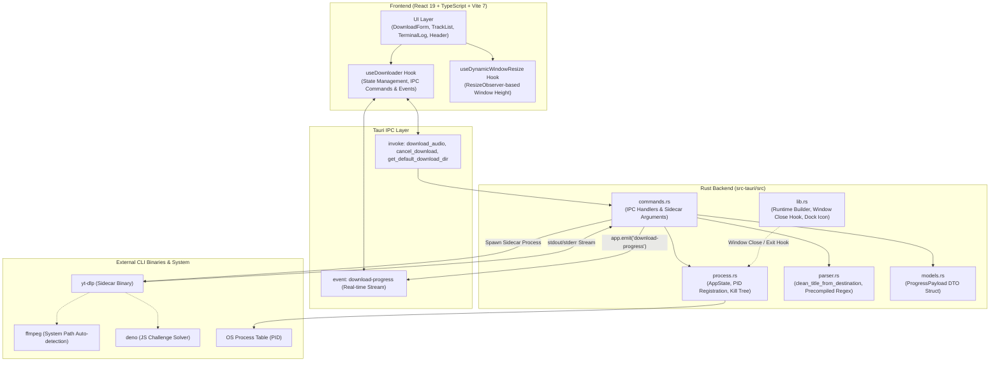

<div align="center">

# 🎵 YouTube Playlist & Audio Downloader

**Lightweight, High-Performance YouTube Audio Downloader built with Tauri v2, Rust, React 19, and Tailwind CSS**

[English](README_EN.md) | [한국어](README.md)

[](https://v2.tauri.app/)
[](https://www.rust-lang.org/)
[](https://react.dev/)
[](https://www.typescriptlang.org/)
[](https://tailwindcss.com/)
[](https://www.gnu.org/licenses/gpl-3.0)

<p align="center">
  A cross-platform desktop application designed to batch-extract individual YouTube videos or entire large-scale playlists into the highest-quality AAC (<code>.m4a</code>) with a single click, automatically embedding high-resolution album artwork and audio metadata (ID3 tags) directly into the audio files.
</p>

</div>

---

## 📑 Table of Contents
1. [📥 Download & OS Support](#-download--os-support)
2. [✨ Key Features](#-key-features)
3. [🏛️ System Architecture](#️-system-architecture)
4. [⚙️ Prerequisites](#️-prerequisites)
5. [📦 Installation & Build](#-installation--build)
6. [💡 Usage Guide](#-usage-guide)
7. [⚠️ Limitations & Considerations](#️-limitations--considerations)
8. [🔮 Future Roadmap](#-future-roadmap)
9. [👨‍💻 Author & License](#-author--license)

---

## 📥 Download & OS Support

Pre-built binaries are available directly on the **[GitHub Releases](https://github.com/s4ngwoo/youtube-playlist-downloader/releases/latest)** page.

### 💻 Supported Platforms
| Platform | Status | Installer / Binary | Notes |
| :--- | :---: | :--- | :--- |
| **macOS (Apple Silicon)** | **Official** | `*.dmg` (`aarch64`) | Optimized for M1 / M2 / M3 / M4 Macs |
| **Windows (x64)** | **Official** | `*-setup.exe`, `*.msi` | Windows 10/11 (64-bit) |
| **macOS (Intel x86_64)** | ⏳ In Progress | - | Can be built directly from source |
| **Linux** | ⏳ In Progress | - | Can be built directly from source |

#### 💡 First Launch on macOS ("Unidentified Developer" Prompt)
Because this is an open-source application without a paid Apple Developer certificate (Notarization), macOS Gatekeeper may display a security prompt on the first launch stating *"cannot be opened because the developer cannot be verified"*.
1. Open the downloaded `.dmg` file and drag the app icon into your `Applications` folder.
2. In your `Applications` folder, **Right-click (or Control + Click) the app $\rightarrow$ select [Open]**.
3. In the security popup, click **[Open]**. The app will run normally thereafter.  
*(Alternatively, navigate to **System Settings $\rightarrow$ Privacy & Security** and click **"Open Anyway"** at the bottom).*

#### 💡 First Launch on Windows (SmartScreen Prompt)
If the blue Windows SmartScreen popup appears, click **[More info] $\rightarrow$ [Run anyway]** to proceed with installation.

---

## ✨ Key Features

- **⚡ Full Playlist & Single Video Support**
  - Paste any single video link or full playlist URL containing dozens or hundreds of songs. The app automatically detects all items and downloads them sequentially.
- **🎧 Highest Quality (VBR 0) AAC `.m4a` Encoding**
  - Preserves maximum audio fidelity with high-efficiency AAC encoding for crisp, studio-grade sound.
- **🖼️ Automatic Cover Art & Metadata Embedding**
  - Automatically converts YouTube WebP thumbnails to standard high-resolution JPGs and embeds them directly into the `.m4a` container alongside track title and artist tags.
  - Leaves zero leftover thumbnail files (`.jpg`, `.webp`) on disk.
- **📱 Mobile-Friendly ZIP Export (NFC Normalization)**
  - Resolves broken Korean character issues when transferring files from macOS to Android or Windows by normalizing filenames to NFC (composed) format.
  - Create a mobile-friendly ZIP archive with a single click directly within the app.
- **🛡️ Robust Process Tree Cleanup (No Zombie Processes)**
  - When cancelling a download, closing the window, or exiting the application, the underlying process tree (`yt-dlp` and `ffmpeg`) is terminated instantly via native OS signal handlers (`kill -9` on Unix, `taskkill /F /T` on Windows).
- **🚀 YouTube EJS Signature Bypass (Deno Integration)**
  - Automatically detects local Deno JavaScript runtime installations and injects `--js-runtimes deno`, bypassing YouTube's latest signature throttling and anti-scraping challenges.
- **📊 Real-time Track Monitoring & Live Terminal Console**
  - Track-by-track status: Current song index, total count, title, progress bar (%), status badge (`Converting`, `Embedding Artwork`, `Complete`), download speed (`MiB/s`), and ETA.
  - Expandable live console view showing raw `yt-dlp` stdout logs with auto-scroll toggle.
- **🖥️ macOS Native Optimization & Custom Drag Region**
  - Safe-area top padding that gracefully respects the macOS traffic light buttons.
  - Full-width draggable header region via `data-tauri-drag-region`, with transparent app icon integrated in both dev mode and production builds.

---

## 🏛️ System Architecture

Built on **Tauri v2** (consuming over 80% less memory than Electron with instant startup speed), with a modular structure strictly adhering to the **Single Responsibility Principle (SRP)**.



### Directory Structure

```
YoutubePlaylistDownloader/
├── public/                 # Static assets
├── src/                    # React Frontend
│   ├── components/         # Modular UI Components
│   │   ├── icons/          # SVG Icons (GithubIcon, etc.)
│   │   ├── DownloadForm.tsx# Output path picker, URL input, overall progress
│   │   ├── TrackList.tsx   # Per-track progress list and status badges
│   │   ├── TerminalLog.tsx # Live terminal log stream viewer
│   │   ├── Header.tsx      # Window title bar, drag region, links
│   │   └── Footer.tsx      # App footer and developer credits
│   ├── hooks/              # Custom Business Logic Hooks
│   │   ├── useDownloader.ts          # IPC invocations & stream event handlers
│   │   └── useDynamicWindowResize.ts # Dynamic window height based on content
│   ├── types/              # TypeScript interfaces (ProgressPayload, TrackItem)
│   ├── App.tsx             # Root Application Component
│   └── App.css             # Tailwind v4 styles & custom scrollbars
├── src-tauri/              # Rust Backend
│   ├── bin/                # Target-specific yt-dlp sidecar binaries
│   ├── icons/              # Multi-platform app icons (.icns, .ico, .png)
│   ├── src/
│   │   ├── commands.rs     # IPC command handlers (download_audio, cancel_download)
│   │   ├── process.rs      # AppState & PID lifecycle process management
│   │   ├── parser.rs       # stdout regex patterns and title sanitation
│   │   ├── models.rs       # Rust DTO structs
│   │   ├── lib.rs          # App setup, Cocoa Dock icon hook, window events
│   │   └── main.rs         # Application entry point
│   ├── Cargo.toml          # Rust dependencies & metadata
│   └── tauri.conf.json     # Tauri v2 bundle & window configuration
└── package.json
```

---

## ⚙️ Prerequisites

To build from source or develop locally, ensure the following tools are installed:

1. **Node.js**: v18.0.0+ (LTS recommended)
2. **Rust**: Rust 1.77.0+ and Cargo ([https://rustup.rs](https://rustup.rs))
3. **External Dependencies**:
   * **FFmpeg** (Required: for audio stream extraction and thumbnail embedding)
     ```bash
     # macOS (Homebrew)
     brew install ffmpeg

     # Windows (Chocolatey or Scoop)
     choco install ffmpeg
     ```
   * **Deno** (Recommended: bypasses YouTube JS signature challenges & speed limits)
     ```bash
     # macOS
     brew install deno

     # Windows
     choco install deno
     ```

---

## 📦 Installation & Build

### 1. Clone Repository & Install Dependencies
```bash
git clone https://github.com/s4ngwoo/youtube-playlist-downloader.git
cd youtube-playlist-downloader
npm install
```

### 2. Place yt-dlp Sidecar Binary
Place the precompiled `yt-dlp` executable matching your host architecture into `src-tauri/bin/`:
```bash
# macOS Apple Silicon (M1/M2/M3/M4):
# src-tauri/bin/yt-dlp-aarch64-apple-darwin

# macOS Intel:
# src-tauri/bin/yt-dlp-x86_64-apple-darwin

# Windows 64-bit:
# src-tauri/bin/yt-dlp-x86_64-pc-windows-msvc.exe
```
> [!TIP]
> Download the latest binary from [yt-dlp Official Releases](https://github.com/yt-dlp/yt-dlp/releases), rename it according to the Tauri sidecar target triple format, and grant execute permissions (`chmod +x`).

### 3. Run Development Server
```bash
npm run tauri dev
```

### 4. Build Production Bundle
```bash
npm run tauri build
```
* **macOS**: Generates `.dmg` and `.app` bundles in `src-tauri/target/release/bundle/dmg/`
* **Windows**: Generates `.exe` installer and `.msi` packages in `src-tauri/target/release/bundle/nsis/`

---

## 💡 Usage Guide

1. **Set Destination Directory**: Click **Change Folder** to select where downloaded `.m4a` files will be saved (remembered in `localStorage`).
2. **Paste YouTube URL**:
   * **Single Video**: `https://www.youtube.com/watch?v=...`
   * **Playlist**: `https://www.youtube.com/playlist?list=...`
3. **Start Download**: Click **Start Download**.
4. **Monitor Progress**:
   * Track status badges transition smoothly: `Downloading` $\rightarrow$ `Extracting Audio` $\rightarrow$ `Converting Artwork` $\rightarrow$ `Embedding Metadata` $\rightarrow$ `Completed`.
   * Previously downloaded files are automatically detected and skipped.
5. **Cancel Anytime**: Click **Cancel** to immediately terminate background sub-processes safely.

---

## ⚠️ Limitations & Considerations

- **YouTube Algorithm & Signature Changes**
  - If YouTube updates its player signature algorithm, download speeds may temporarily drop. Keeping `yt-dlp` updated or installing Deno ensures maximum reliability.
- **FFmpeg Dependency**
  - FFmpeg must be installed and accessible via system `PATH` (or default locations `/opt/homebrew/bin`, `/usr/local/bin`).
- **Copyright & Terms of Service**
  - This application is created for personal research and offline educational archiving.
  - Downloading copyrighted content without authorization from the copyright holder may violate local copyright laws or YouTube's Terms of Service. The user assumes all responsibility for its use.
- **DRM-Protected Content**
  - DRM-encrypted media (such as YouTube Movies or paid membership rentals) cannot be downloaded.

---

## 🔮 Future Roadmap

- [ ] **Multi-format Support**: Configurable output formats (MP3, FLAC, WAV, OPUS)
- [ ] **Concurrent Downloads**: Multi-threaded parallel downloading for high-bandwidth connections
- [ ] **In-App Auto-Update for yt-dlp**: One-click sidecar binary update without manual replacement
- [ ] **Download History**: Session history and direct folder shortcuts
- [ ] **Built-in Mini Audio Player**: Lightweight playback preview for completed `.m4a` tracks

---

## 👨‍💻 Author & License

- **Author**: Lee SangWoo
- **Email**: [s4ngwoo.lee@gmail.com](mailto:s4ngwoo.lee@gmail.com)
- **GitHub**: [@s4ngwoo](https://github.com/s4ngwoo)

This project is licensed under the **[GNU General Public License v3.0 (GPL-3.0)](LICENSE)**. You are free to inspect, modify, and redistribute the source code, provided that all derivative works remain open-source under the same GPL-3.0 license, preventing proprietary commercialization.
