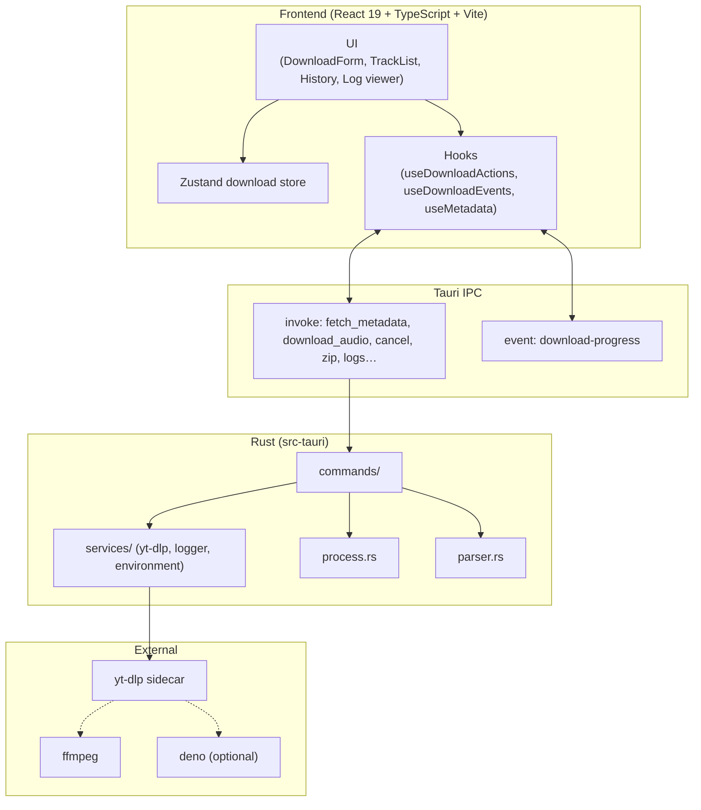

<div align="center">

# YouTube Playlist & Audio Downloader

**Tauri v2 + Rust + React 19 + Tailwind CSS 기반의 초경량·고성능 유튜브 오디오 다운로더**

[English](README.md) | [한국어](README_KO.md)

[](https://v2.tauri.app/)
[](https://www.rust-lang.org/)
[](https://react.dev/)
[](https://www.typescriptlang.org/)
[](https://tailwindcss.com/)
[](https://www.gnu.org/licenses/gpl-3.0)

<p align="center">
  유튜브 단일 영상과 대규모 재생목록을 한 번에 고음질 AAC (<code>.m4a</code>)로 추출하고,<br>
  앨범 커버아트와 오디오 메타데이터를 파일에 자동으로 임베딩하는 크로스플랫폼 데스크톱 앱입니다.
</p>

</div>

---

## 목차

1. [앱 다운로드 및 지원 환경](#앱-다운로드-및-지원-환경)
2. [주요 기능](#주요-기능)
3. [문서](#문서)
4. [시스템 아키텍처](#시스템-아키텍처)
5. [사전 요구사항](#사전-요구사항)
6. [설치 및 빌드](#설치-및-빌드)
7. [사용 방법](#사용-방법)
8. [한계점 및 유의사항](#한계점-및-유의사항)
9. [로드맵](#로드맵)
10. [작성자 및 라이선스](#작성자-및-라이선스)

---

## 앱 다운로드 및 지원 환경

최신 빌드는 **[GitHub Releases](https://github.com/s4ngwoo/youtube-playlist-downloader/releases/latest)**에서 받을 수 있습니다.

| 플랫폼 | 지원 | 다운로드 파일 | 비고 |
| :--- | :---: | :--- | :--- |
| **macOS (Apple Silicon)** | **공식** | `*.dmg` (`aarch64`) | M1 / M2 / M3 / M4 |
| **macOS (Intel x86_64)** | **공식** | `*.dmg` (`x64` / `x86_64`) | Intel Mac |
| **Windows (x64)** | **공식** | `*-setup.exe`, `*.msi` | Windows 10/11 (64-bit) |
| **Linux** | **계획 없음** | — | 소스 빌드 가능 · CLI yt-dlp 권장 |

### macOS 첫 실행 ("확인되지 않은 개발자")

유료 Apple 개발자 인증(Notarization)을 거치지 않은 오픈소스 빌드이므로 Gatekeeper 경고가 날 수 있습니다.

1. `.dmg`를 열고 앱을 **응용 프로그램**으로 드래그합니다.
2. 응용 프로그램에서 **우클릭(또는 Control+클릭) → 열기**를 선택합니다.
3. 보안 팝업에서 **열기**를 확인합니다.  
   또는 **시스템 설정 → 개인정보 보호 및 보안 → 확인 없이 열기**.

### Windows 첫 실행 (SmartScreen)

SmartScreen이 뜨면 **추가 정보 → 실행**을 선택하세요.

---

## 주요 기능

- **플레이리스트·단일 영상 지원** — URL만 넣으면 트랙을 감지하고 일괄 다운로드합니다.
- **선택 다운로드** — 메타데이터를 먼저 불러온 뒤 원하는 트랙만 골라 받을 수 있습니다.
- **고음질 AAC `.m4a`** — 고품질 오디오 추출과 커버아트·태그 임베딩.
- **메타데이터 편집** — 제목/아티스트 등 태그를 조정할 수 있습니다.
- **다운로드 히스토리** — 이전에 받은 플레이리스트 URL을 로컬에 저장하고 다시 불러옵니다.
- **모바일 호환 ZIP (NFC)** — macOS NFD 파일명 깨짐을 줄이기 위해 NFC로 정규화한 ZIP을 만듭니다.
- **프로세스 트리 정리** — 취소·창 닫기·종료 시 `yt-dlp` / `ffmpeg` 하위 프로세스를 정리합니다.
- **Deno 연동 yt-dlp** — 시스템에 Deno가 있으면 YouTube JS 챌린지 해결에 활용합니다.
- **앱 로그 뷰어** — 로컬에 남는 로그를 전용 창에서 확인할 수 있습니다.
- **macOS UI** — 신호등 버튼 여백과 드래그 가능한 타이틀 영역.

---

## 문서

한국어 문서는 [`docs/ko/`](docs/ko/README.md)에, 영문은 [`docs/`](docs/README.md)에 있습니다. 프로젝트는 **오픈소스(GPL-3.0)** 로 유지됩니다.

| 문서 | 한국어 | 영문 |
| :--- | :--- | :--- |
| 개인정보 처리방침 | [docs/ko/PRIVACY.md](docs/ko/PRIVACY.md) | [docs/PRIVACY.md](docs/PRIVACY.md) |
| 이용 약관 | [docs/ko/TERMS.md](docs/ko/TERMS.md) | [docs/TERMS.md](docs/TERMS.md) |
| 보안 | [docs/ko/SECURITY.md](docs/ko/SECURITY.md) | [docs/SECURITY.md](docs/SECURITY.md) |
| 기여 가이드 | [docs/ko/CONTRIBUTING.md](docs/ko/CONTRIBUTING.md) | [docs/CONTRIBUTING.md](docs/CONTRIBUTING.md) |
| 행동 강령 | [docs/ko/CODE_OF_CONDUCT.md](docs/ko/CODE_OF_CONDUCT.md) | [docs/CODE_OF_CONDUCT.md](docs/CODE_OF_CONDUCT.md) |
| FAQ | [docs/ko/FAQ.md](docs/ko/FAQ.md) | [docs/FAQ.md](docs/FAQ.md) |
| 지원 | [docs/ko/SUPPORT.md](docs/ko/SUPPORT.md) | [docs/SUPPORT.md](docs/SUPPORT.md) |
| 변경 이력 | [docs/ko/CHANGELOG.md](docs/ko/CHANGELOG.md) | [docs/CHANGELOG.md](docs/CHANGELOG.md) |

영문 README(기본): **[README.md](README.md)**

---

## 시스템 아키텍처

**Tauri v2** 기반이며, React 프론트엔드와 Rust 백엔드가 IPC로 통신합니다.



### 디렉터리 구조 (요약)

```
YoutubePlaylistDownloader/
├── src/                 # React 프론트엔드
├── src-tauri/           # Rust 백엔드 및 yt-dlp 사이드카
├── docs/                # 프로젝트 문서
├── .github/workflows/   # 릴리즈 CI
├── LICENSE              # GPL-3.0
└── package.json
```

---

## 사전 요구사항

1. **Node.js** 18+ (LTS 권장)
2. **Rust** 1.77+ 및 Cargo — [rustup.rs](https://rustup.rs)
3. **FFmpeg** (오디오·썸네일 처리에 필요)

```bash
# macOS
brew install ffmpeg

# Windows (Chocolatey)
choco install ffmpeg
```

4. **Deno** (YouTube JS 챌린지 대응용, 권장)

```bash
# macOS
brew install deno

# Windows
choco install deno
```

---

## 설치 및 빌드

### 1. 클론 및 의존성 설치

```bash
git clone https://github.com/s4ngwoo/youtube-playlist-downloader.git
cd youtube-playlist-downloader
npm install
```

### 2. yt-dlp 사이드카 배치

플랫폼에 맞는 바이너리를 `src-tauri/bin/`에 둡니다.

```text
# macOS Apple Silicon
src-tauri/bin/yt-dlp-aarch64-apple-darwin

# macOS Intel
src-tauri/bin/yt-dlp-x86_64-apple-darwin

# Windows x64
src-tauri/bin/yt-dlp-x86_64-pc-windows-msvc.exe
```

[yt-dlp 릴리즈](https://github.com/yt-dlp/yt-dlp/releases)에서 받아 이름을 맞추고, Unix에서는 `chmod +x`를 부여하세요.

### 3. 개발 실행

```bash
npm run tauri dev
```

### 4. 프로덕션 빌드

```bash
npm run tauri build
```

- **macOS**: `src-tauri/target/release/bundle/` 아래 `.dmg` / `.app`
- **Windows**: NSIS / MSI 패키지

---

## 사용 방법

1. **폴더 변경**으로 저장 위치를 지정합니다 (앱 설정 `settings.json`에 저장).
2. 필요하면 **동시 다운로드**(1–8)와 **오디오 포맷**(m4a/mp3)을 고릅니다.
3. 유튜브 영상 또는 플레이리스트 URL을 붙여넣습니다.
4. 메타데이터를 불러온 뒤 필요하면 트랙을 선택하고 다운로드를 시작합니다.
5. 트랙별 진행 상태를 확인하고, 실패 항목은 재시도할 수 있습니다.
6. 모바일용 ZIP, **환경 진단**, 앱 로그 뷰어를 사용할 수 있습니다.
7. **취소** 시 백그라운드 프로세스까지 정리됩니다.

---

## 한계점 및 유의사항

- YouTube 시그니처·정책 변경으로 다운로드가 일시적으로 실패하거나 느려질 수 있습니다. `yt-dlp`(및 Deno)를 최신으로 유지하세요.
- FFmpeg가 `PATH`(또는 일반 설치 경로)에 있어야 합니다.
- **저작권·이용약관**: 개인·교육·오프라인 감상 목적의 도구입니다. 관련 법과 YouTube 약관 준수 책임은 사용자에게 있습니다. [이용 약관](docs/ko/TERMS.md)을 참고하세요.
- DRM 보호 콘텐츠는 받을 수 없습니다.

---

## 로드맵

- [x] 오디오 포맷 선택 — **m4a / mp3** (FLAC, WAV, OPUS는 추후)
- [x] 동시 다운로드 수 설정 — **1–8**
- [ ] 앱 내 yt-dlp 자동 업데이트
- [ ] 히스토리·폴더 바로가기 강화
- [ ] 내장 미니 오디오 프리뷰
- [x] Intel macOS 공식 릴리즈 바이너리
- [x] Linux 공식 바이너리 — **계획 없음** (배포판 파편화 · CLI yt-dlp로 충분)

---

## 작성자 및 라이선스

- **개발자**: Lee SangWoo
- **이메일**: [s4ngwoo.lee@gmail.com](mailto:s4ngwoo.lee@gmail.com)
- **GitHub**: [@s4ngwoo](https://github.com/s4ngwoo)

본 프로젝트는 **[GNU General Public License v3.0](LICENSE)**으로 배포됩니다. 소스 열람·수정·재배포가 가능하며, 파생 저작물도 동일 GPL-3.0으로 공개해야 합니다.
