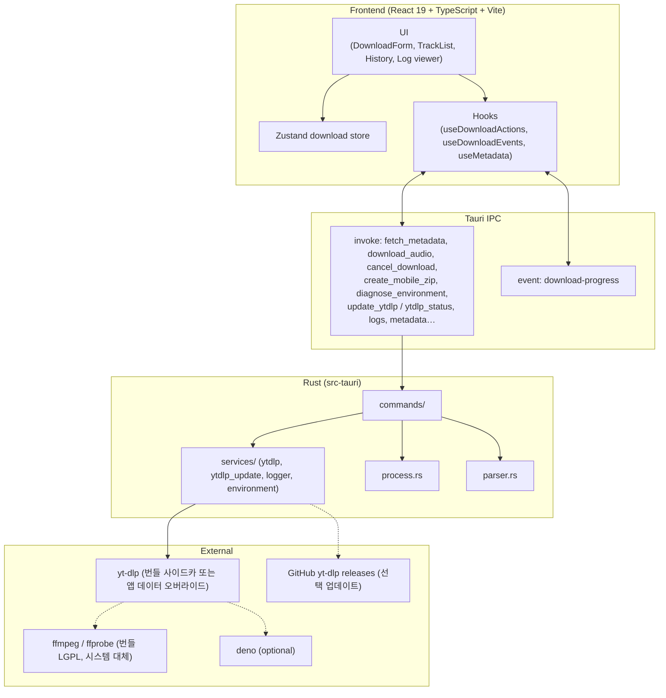

<div align="center">

# YouTube Playlist & Audio Downloader

**Tauri v2 + Rust + React 19 + Tailwind CSS 기반의 초경량·고성능 유튜브 오디오 다운로더**

[English](README.md) | [한국어](README_KO.md)

[](https://v2.tauri.app/)
[](https://www.rust-lang.org/)
[](https://react.dev/)
[](https://www.typescriptlang.org/)
[](https://tailwindcss.com/)
[](https://www.gnu.org/licenses/gpl-3.0)

<p align="center">
  유튜브 단일 영상과 대규모 재생목록을 <code>.m4a</code> 또는 <code>.mp3</code>로 일괄 추출하고,<br>
  앨범 커버아트와 오디오 메타데이터를 파일에 자동으로 임베딩하는 크로스플랫폼 데스크톱 앱입니다.
</p>

</div>

---

## 목차

1. [앱 다운로드 및 지원 환경](#앱-다운로드-및-지원-환경)
2. [주요 기능](#주요-기능)
3. [문서](#문서)
4. [시스템 아키텍처](#시스템-아키텍처)
5. [사전 요구사항](#사전-요구사항)
6. [설치 및 빌드](#설치-및-빌드)
7. [사용 방법](#사용-방법)
8. [한계점 및 유의사항](#한계점-및-유의사항)
9. [로드맵](#로드맵)
10. [작성자 및 라이선스](#작성자-및-라이선스)

---

## 앱 다운로드 및 지원 환경

최신 빌드는 **[GitHub Releases](https://github.com/s4ngwoo/youtube-playlist-downloader/releases/latest)**에서 받을 수 있습니다.

| 플랫폼 | 지원 | 다운로드 파일 | 비고 |
| :--- | :---: | :--- | :--- |
| **macOS (Apple Silicon)** | **공식** | `*.dmg` (`aarch64`) | M1 / M2 / M3 / M4 |
| **macOS (Intel x86_64)** | **공식** | `*.dmg` (`x64` / `x86_64`) | Intel Mac |
| **Windows (x64)** | **공식** | `*-setup.exe`, `*.msi` | Windows 10/11 (64-bit) |
| **Linux** | **계획 없음** | — | 소스 빌드 가능 · CLI yt-dlp 권장 |

### macOS 첫 실행 ("확인되지 않은 개발자")

유료 Apple 개발자 인증(Notarization)은 **하지 않습니다**(계정·비용 없음). Gatekeeper 경고가 날 수 있습니다.

1. `.dmg`를 열고 앱을 **응용 프로그램**으로 드래그합니다.
2. 응용 프로그램에서 **우클릭(또는 Control+클릭) → 열기**를 선택합니다.
3. 보안 팝업에서 **열기**를 확인합니다.  
   또는 **시스템 설정 → 개인정보 보호 및 보안 → 확인 없이 열기**.

### Windows 첫 실행 (SmartScreen)

SmartScreen이 뜨면 **추가 정보 → 실행**을 선택하세요.

---

## 주요 기능

- **플레이리스트·단일 영상 지원** — URL만 넣으면 트랙을 감지하고 일괄 다운로드합니다.
- **선택 다운로드** — 메타데이터를 먼저 불러온 뒤 원하는 트랙만 골라 받을 수 있습니다.
- **비공개·삭제 건너뜀** — 받을 수 없는 슬롯은 사유와 함께 건너뜀으로 표시합니다(flat dump + 필요 시 id별 probe).
- **오디오 포맷** — **`.m4a` 또는 `.mp3`**로 추출하고 커버아트·태그를 임베딩합니다(자막은 기본 OFF).
- **동시 다운로드** — **1–8** 병렬(기본 3); 앱 설정에 저장됩니다. [CONCURRENCY.md](docs/ko/CONCURRENCY.md) 참고.
- **깔끔한 파일명** — `제목.확장자`로 저장(`[영상 ID]` 없음); 같은 파일이 있으면 건너뜁니다. [FILENAMES.md](docs/ko/FILENAMES.md).
- **EN / KO UI** — 헤더에서 언어 전환; `settings.json`에 locale 저장.
- **메타데이터 편집** — 제목/아티스트 등 태그를 조정할 수 있습니다.
- **다운로드 히스토리** — 이전에 받은 플레이리스트 URL을 로컬에 저장하고 다시 불러옵니다.
- **모바일 호환 ZIP (NFC)** — macOS NFD 파일명 깨짐을 줄이기 위해 NFC로 정규화한 ZIP을 만듭니다.
- **환경 진단** — 푸터에서 FFmpeg(번들/시스템)·Deno·yt-dlp 소스/버전을 확인합니다.
- **앱 내 yt-dlp 업데이트** — 최신 바이너리를 앱 데이터 `sidecars/`에 받아 사용(오버라이드; 릴리즈 번들 사이드카는 덮어쓰지 않음). 버튼은 **헤더**.
- **프로세스 트리 정리** — 취소·창 닫기·종료 시 `yt-dlp` / `ffmpeg` 하위 프로세스를 정리합니다.
- **LGPL FFmpeg 번들** — 공식 빌드에 `ffmpeg` / `ffprobe` 사이드카 포함(별도 설치 불필요). 시스템 FFmpeg는 대체 경로.
- **Deno 연동 yt-dlp** — 시스템에 Deno가 있으면 YouTube JS 챌린지 해결에 활용합니다(선택, 미번들).
- **앱 로그 뷰어** — 로컬에 남는 로그를 전용 창에서 확인할 수 있습니다.
- **macOS UI** — 신호등 버튼 여백과 드래그 가능한 타이틀 영역.

---

## 문서

한국어 문서는 [`docs/ko/`](docs/ko/README.md)에, 영문은 [`docs/`](docs/README.md)에 있습니다. 프로젝트는 **오픈소스(GPL-3.0)** 로 유지됩니다.

| 문서 | 한국어 | 영문 |
| :--- | :--- | :--- |
| 개인정보 처리방침 | [docs/ko/PRIVACY.md](docs/ko/PRIVACY.md) | [docs/PRIVACY.md](docs/PRIVACY.md) |
| 이용 약관 | [docs/ko/TERMS.md](docs/ko/TERMS.md) | [docs/TERMS.md](docs/TERMS.md) |
| 보안 | [docs/ko/SECURITY.md](docs/ko/SECURITY.md) | [docs/SECURITY.md](docs/SECURITY.md) |
| 기여 가이드 | [docs/ko/CONTRIBUTING.md](docs/ko/CONTRIBUTING.md) | [docs/CONTRIBUTING.md](docs/CONTRIBUTING.md) |
| 행동 강령 | [docs/ko/CODE_OF_CONDUCT.md](docs/ko/CODE_OF_CONDUCT.md) | [docs/CODE_OF_CONDUCT.md](docs/CODE_OF_CONDUCT.md) |
| FAQ | [docs/ko/FAQ.md](docs/ko/FAQ.md) | [docs/FAQ.md](docs/FAQ.md) |
| FFmpeg (번들) | [docs/ko/FFMPEG.md](docs/ko/FFMPEG.md) | [docs/FFMPEG.md](docs/FFMPEG.md) |
| 동시 다운로드 | [docs/ko/CONCURRENCY.md](docs/ko/CONCURRENCY.md) | [docs/CONCURRENCY.md](docs/CONCURRENCY.md) |
| 저장 파일명 | [docs/ko/FILENAMES.md](docs/ko/FILENAMES.md) | [docs/FILENAMES.md](docs/FILENAMES.md) |
| 지원 | [docs/ko/SUPPORT.md](docs/ko/SUPPORT.md) | [docs/SUPPORT.md](docs/SUPPORT.md) |
| 릴리즈 | [docs/ko/RELEASING.md](docs/ko/RELEASING.md) | [docs/RELEASING.md](docs/RELEASING.md) |
| 릴리즈 실패 패턴 | [docs/ko/RELEASE_FAILURES.md](docs/ko/RELEASE_FAILURES.md) | [docs/RELEASE_FAILURES.md](docs/RELEASE_FAILURES.md) |
| 서드파티 | [docs/ko/THIRD_PARTY.md](docs/ko/THIRD_PARTY.md) | [docs/THIRD_PARTY.md](docs/THIRD_PARTY.md) |
| 변경 이력 | [docs/ko/CHANGELOG.md](docs/ko/CHANGELOG.md) | [docs/CHANGELOG.md](docs/CHANGELOG.md) |

영문 README(기본): **[README.md](README.md)**

---

## 시스템 아키텍처

**Tauri v2** 기반이며, React 프론트엔드와 Rust 백엔드가 IPC로 통신합니다.



### 디렉터리 구조 (요약)

```
YoutubePlaylistDownloader/
├── src/                 # React 프론트엔드 (components, hooks, store, i18n)
├── src-tauri/           # Rust 백엔드 및 yt-dlp 사이드카
├── docs/                # 프로젝트 문서
├── .github/workflows/   # PR CI (ci.yml) + 릴리즈 (release.yml)
├── LICENSE              # GPL-3.0
└── package.json
```

---

## 사전 요구사항

1. **Node.js** 18+ (LTS 권장)
2. **Rust** 1.77+ 및 Cargo — [rustup.rs](https://rustup.rs)
3. **FFmpeg / ffprobe 사이드카** (`tauri dev` / 로컬 패키징용)

공식 GitHub Releases는 **LGPL FFmpeg를 번들**합니다 — 일반 사용자는 별도 설치가 필요 없습니다.
로컬 개발 시 사이드카를 준비하거나(권장), 시스템 FFmpeg를 `PATH`에 두세요.

```bash
# 릴리즈와 동일한 레이아웃 권장
./scripts/prepare-ffmpeg-sidecar.sh

# 임시 대안:
# macOS: brew install ffmpeg
# Windows: choco install ffmpeg
```

4. **Deno** (선택; YouTube JS 챌린지 대응용, 미번들)

```bash
# macOS
brew install deno

# Windows
choco install deno
```

---

## 설치 및 빌드

### 1. 클론 및 의존성 설치

```bash
git clone https://github.com/s4ngwoo/youtube-playlist-downloader.git
cd youtube-playlist-downloader
npm install
```

### 2. yt-dlp / FFmpeg 사이드카 배치

플랫폼에 맞는 바이너리를 `src-tauri/bin/`에 둡니다.

```text
# macOS Apple Silicon
src-tauri/bin/yt-dlp-aarch64-apple-darwin
src-tauri/bin/ffmpeg-aarch64-apple-darwin
src-tauri/bin/ffprobe-aarch64-apple-darwin

# macOS Intel
src-tauri/bin/yt-dlp-x86_64-apple-darwin
src-tauri/bin/ffmpeg-x86_64-apple-darwin
src-tauri/bin/ffprobe-x86_64-apple-darwin

# Windows x64
src-tauri/bin/yt-dlp-x86_64-pc-windows-msvc.exe
src-tauri/bin/ffmpeg-x86_64-pc-windows-msvc.exe
src-tauri/bin/ffprobe-x86_64-pc-windows-msvc.exe
```

FFmpeg (LGPL): `./scripts/prepare-ffmpeg-sidecar.sh`  
yt-dlp: [yt-dlp 릴리즈](https://github.com/yt-dlp/yt-dlp/releases)에서 받아 이름을 맞추고, Unix에서는 `chmod +x`를 부여하세요.

**트리플은 지금 개발·패키징하는 머신과 일치해야 합니다.** Apple Silicon은 `aarch64-apple-darwin`, Intel Mac은 `x86_64-apple-darwin`. 잘못된 파일(또는 CI용 stub만)을 `bin/`에 두면 `tauri dev`·로컬 DMG에서 사이드카 없음/메타 fetch 실패가 납니다. 머신 전환 시 트리플을 섞지 말고, **이 호스트용** 이름 하나만 두세요.

### 3. 개발 실행

```bash
npm run tauri dev
```

### 4. 프로덕션 빌드

```bash
npm run tauri build
```

- **macOS**: `src-tauri/target/release/bundle/` 아래 `.dmg` / `.app`
- **Windows**: NSIS / MSI 패키지

---

## 사용 방법

1. **폴더 변경**으로 저장 위치를 지정합니다 (앱 설정 `settings.json`에 저장).
2. 필요하면 **동시 다운로드**(1–8)와 **오디오 포맷**(m4a/mp3)을 고릅니다.
3. 유튜브 영상 또는 플레이리스트 URL을 붙여넣습니다.
4. 메타데이터를 불러온 뒤 필요하면 트랙을 선택하고 다운로드를 시작합니다.
5. 트랙별 진행 상태를 확인하고, 실패 항목은 재시도할 수 있습니다.
6. 모바일용 ZIP, **환경 진단**(푸터), **yt-dlp 업데이트**(헤더), 앱 로그 뷰어를 사용할 수 있습니다.
7. **취소** 시 백그라운드 프로세스까지 정리됩니다.

---

## 한계점 및 유의사항

- YouTube 시그니처·정책 변경으로 다운로드가 일시적으로 실패하거나 느려질 수 있습니다. `yt-dlp`(및 Deno)를 최신으로 유지하세요(헤더 **yt-dlp 업데이트** 또는 다음 앱 릴리즈).
- 공식 빌드는 LGPL FFmpeg를 번들합니다. 진단에서 없으면 앱을 다시 설치하세요(개발 시 사이드카 준비 또는 시스템 FFmpeg 대체 가능). [FFMPEG.md](docs/ko/FFMPEG.md) 참고.
- **저작권·이용약관**: 개인·교육·오프라인 감상 목적의 도구입니다. 관련 법과 YouTube 약관 준수 책임은 사용자에게 있습니다. [이용 약관](docs/ko/TERMS.md)을 참고하세요.
- DRM 보호 콘텐츠는 받을 수 없습니다.

---

## 로드맵

**반영됨:** 일괄 진행·실패 UX · 비공개/삭제 건너뜀(사유) · 실패만 필터 · 히스토리 폴더 · 고급 콘솔 · 제목만 파일명 · 동시성 가이드 · 헤더 yt-dlp 업데이트 / 푸터 진단·로그 · 로그 뷰어 · 자막 기본 OFF · m4a/mp3 · 동시성 1–8 · Apple Silicon + Intel Mac + Windows x64

**나중에 (열린 버그 아님):**

- [ ] 받기와 후처리를 나누는 구조 (동시성 체감)
- [ ] 미니 플레이어 · 테마 · 추가 포맷 (수요 시)
- [ ] 자막 받기 옵션 (기본은 OFF)
- [ ] YouTube/yt-dlp 깨짐 시 안내 강화 (업데이트 버튼 + FAQ; 근본은 업스트림)

**하지 않음:**

- [x] Linux 공식 바이너리 — **계획 없음**
- [x] Apple Notarization — **하지 않음** (Gatekeeper 안내는 README 유지)

---

## 작성자 및 라이선스

- **개발자**: Lee SangWoo
- **이메일**: [s4ngwoo.lee@gmail.com](mailto:s4ngwoo.lee@gmail.com)
- **GitHub**: [@s4ngwoo](https://github.com/s4ngwoo)

본 프로젝트는 **[GNU General Public License v3.0](LICENSE)**으로 배포됩니다. 소스 열람·수정·재배포가 가능하며, 파생 저작물도 동일 GPL-3.0으로 공개해야 합니다.

번들 **FFmpeg**는 **LGPL**입니다 — [docs/ko/THIRD_PARTY.md](docs/ko/THIRD_PARTY.md), [docs/ko/FFMPEG.md](docs/ko/FFMPEG.md).
